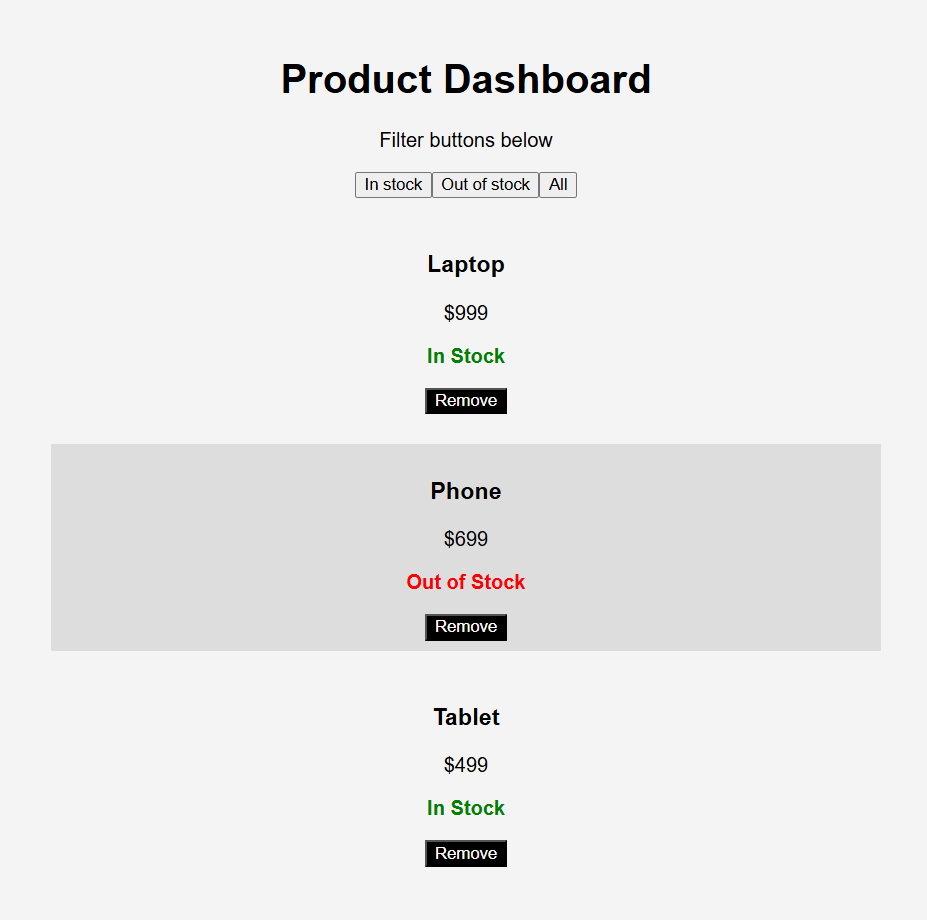

# Product Dashboard

Product Dashboard is a React-based application built as part of a front-end lab focused on component architecture, state management, conditional rendering, event handling, and UI styling. The dashboard displays a list of products, allows users to filter products by stock availability, supports removing products from the page, and visually distinguishes in-stock and out-of-stock items.

## Overview

This project simulates a simple e-commerce product dashboard. Each product displays a name, price, image, and availability status. Users can filter the dashboard to view all products, only in-stock products, or only out-of-stock products. Products can also be removed from the dashboard using a Remove button.

The application is built with reusable React components and styled with CSS Modules. It also includes conditional styling so unavailable products are visually different from available products.

## Features

- Displays products dynamically from an array of product objects
- Renders reusable `ProductCard` components through `ProductList`
- Shows each product’s name, price, image, and stock status
- Filters products by availability using React state
- Supports removing individual products from the dashboard
- Applies different styling for out-of-stock products
- Uses green status text for in-stock products
- Uses red status text for out-of-stock products
- Includes styled product cards with borders and spacing
- Includes a styled Remove button with hover behavior
- Supports a custom favicon/logo

## Technologies Used

- React
- JavaScript ES6+
- CSS Modules
- React Hooks
- Vite
- Jest
- React Testing Library

## Project Structure

```text
src/
├── assets/
│   ├── laptop.png
│   ├── phone.png
│   └── tablet.png
├── components/
│   ├── ProductCard.jsx
│   └── ProductList.jsx
├── styles/
│   └── ProductCard.module.css
├── App.jsx
└── main.js
```

## Components

### App.jsx

`App.jsx` is the main application component. It stores the product data in state, tracks the selected filter, handles product removal, and passes filtered products to the `ProductList` component.

### ProductList.jsx

`ProductList.jsx` receives the filtered product array from `App.jsx`. It checks whether products are available to display and maps over the product list to render one `ProductCard` for each product.

### ProductCard.jsx

`ProductCard.jsx` displays the details for a single product. It renders the product image, name, price, availability status, and Remove button. It also applies conditional styling when a product is out of stock.

### ProductCard.module.css

`ProductCard.module.css` contains the styling for product cards, out-of-stock products, stock status text, product images, and the Remove button.

## Screenshot

```md

```

## Installation

Clone the repository:

```bash
git clone <https://github.com/Matt20Swanberg/lab-product-dashboard-vite>
```

Navigate into the project directory:

```bash
cd product-dashboard
```

Install dependencies:

```bash
npm install
```

## Running the Application

Start the development server:

```bash
npm run dev
```

Open the application in your browser. Vite commonly runs locally at:

```text
http://localhost:5173
```

## Running Tests

Run the test suite:

```bash
npm test
```

The application was built to satisfy the provided Jest and React Testing Library tests for rendering the dashboard title, displaying products, applying conditional styling, and removing products.

## Future Improvements

Potential future enhancements include product search, sorting, editing products, persistent storage, responsive mobile styling, dark mode, product categories, API integration, quantity tracking, and shopping cart functionality.

## Author

Created by Matthew Swanberg

## License

Created for course 4 mod 3 lab.